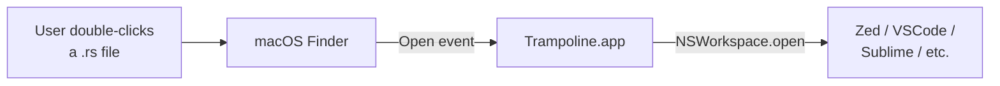
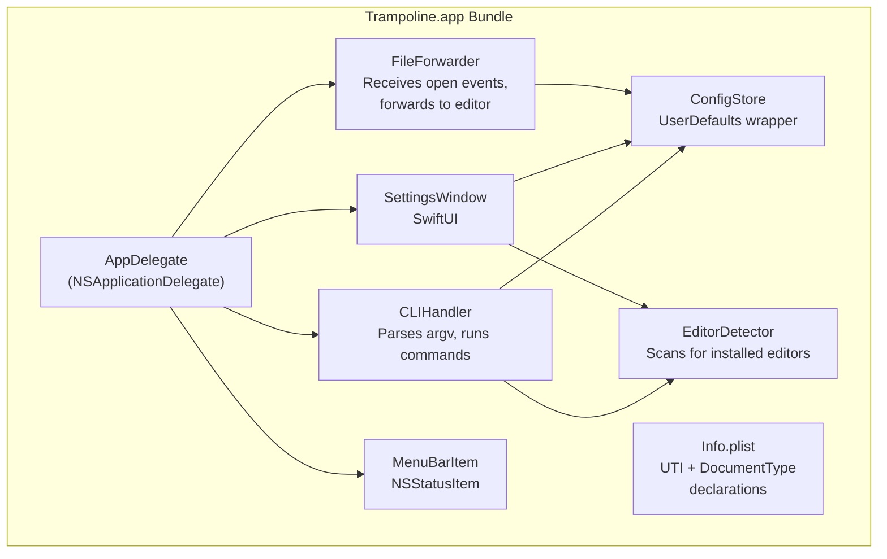
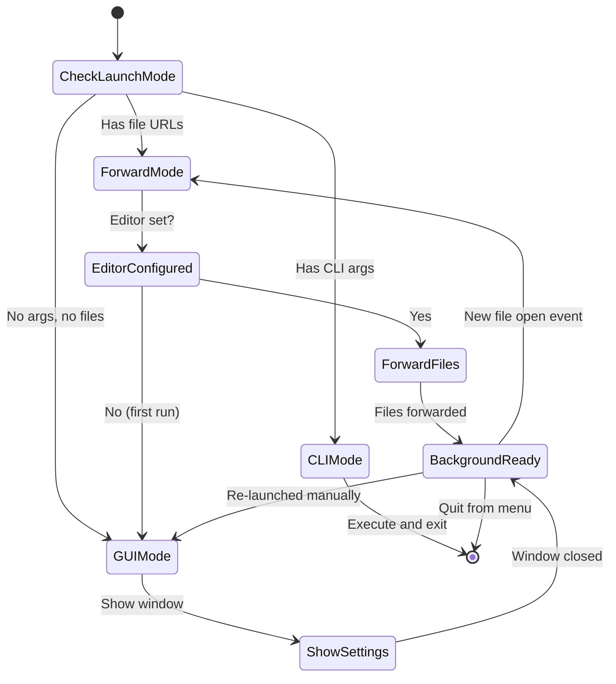

# Architecture

## System Context



Trampoline sits between Finder and the user's editor. To Finder, Trampoline IS
the editor for developer files. To the user, the file opens in their real
editor. Trampoline is never visible.

## Component Architecture



## Component Responsibilities

### AppDelegate

The entry point. Determines the launch mode:

| Condition                             | Mode            | Behavior                              |
| ------------------------------------- | --------------- | ------------------------------------- |
| Launched with file URLs               | Trampoline mode | Forward files to editor, stay running |
| Launched with CLI args                | CLI mode        | Execute command, exit                 |
| Launched manually (no args, no files) | GUI mode        | Show settings window                  |
| Already running, re-launched          | GUI mode        | Bring settings window to front        |

### FileForwarder

Receives `application(_:open:)` calls from AppKit. For each file URL:

1. Read the configured editor bundle ID from `ConfigStore`
2. Call `NSWorkspace.shared.open([url], withApplicationAt: editorURL, configuration: config)`
3. Log the forwarding action (debug only)

If no editor is configured, show the settings window instead (first-run
experience).

### ConfigStore

Thin wrapper around `UserDefaults.standard` for the `com.maelos.trampoline`
domain. Stores:

| Key                 | Type       | Default | Description                                  |
| ------------------- | ---------- | ------- | -------------------------------------------- |
| `editorBundleID`    | `String?`  | `nil`   | The user's chosen editor                     |
| `editorDisplayName` | `String?`  | `nil`   | Cached display name                          |
| `showMenuBarIcon`   | `Bool`     | `true`  | Whether to show status item                  |
| `claimedExtensions` | `[String]` | `[]`    | Extensions Trampoline has claimed via LS API |
| `firstRunComplete`  | `Bool`     | `false` | Whether first-run setup finished             |

### EditorDetector

Scans for installed code editors using `mdfind
'kMDItemCFBundleIdentifier == "<id>"'` for known editors, then verifies
with `NSWorkspace.shared.urlForApplication(withBundleIdentifier:)`.

Known editors:

| Shorthand         | Bundle ID                       | Display Name       |
| ----------------- | ------------------------------- | ------------------ |
| `zed`             | `dev.zed.Zed`                   | Zed                |
| `vscode`          | `com.microsoft.VSCode`          | Visual Studio Code |
| `vscode-insiders` | `com.microsoft.VSCodeInsiders`  | VS Code Insiders   |
| `cursor`          | `com.todesktop.230313mzl4w4u92` | Cursor             |
| `sublime`         | `com.sublimetext.4`             | Sublime Text       |
| `nova`            | `com.panic.Nova`                | Nova               |
| `bbedit`          | `com.barebones.bbedit`          | BBEdit             |
| `textmate`        | `com.macromates.TextMate`       | TextMate           |
| `webstorm`        | `com.jetbrains.WebStorm`        | WebStorm           |
| `intellij`        | `com.jetbrains.intellij`        | IntelliJ IDEA      |
| `fleet`           | `com.jetbrains.fleet`           | Fleet              |

Additional editors detected dynamically via Spotlight query for apps that
declare `CFBundleDocumentTypes` with `public.source-code` or
`public.plain-text`.

### CLIHandler

Detects CLI mode via `argv[0]` (when invoked as a `trampoline` symlink) or
the presence of subcommand arguments. Parses and dispatches commands.

### SettingsWindow

SwiftUI window with tab-based navigation. Detailed in
[04-wireframes.md](04-wireframes.md).

### MenuBarItem

Optional `NSStatusItem` with a dropdown menu:

- Current editor name (disabled label)
- "Settings..." (opens settings window)
- Separator
- "Quit Trampoline"

## App Lifecycle



## Technology Stack

| Layer            | Technology                                                      | Rationale                                                      |
| ---------------- | --------------------------------------------------------------- | -------------------------------------------------------------- |
| App framework    | AppKit (`NSApplication`)                                        | Required for `application(_:open:)` file events                |
| UI               | SwiftUI                                                         | Modern, declarative, sufficient for settings UI                |
| Config           | `UserDefaults`                                                  | Standard macOS, no dependencies, CLI-accessible via `defaults` |
| Editor detection | Spotlight (`mdfind`) + `NSWorkspace`                            | System-native, no permissions needed                           |
| Handler claiming | `LSSetDefaultRoleHandlerForContentType`                         | Public CoreServices API                                        |
| UTI resolution   | `UTType(filenameExtension:)`                                    | In-process, correct dynamic UTIs                               |
| Build system     | `swift build` (SPM) or Makefile + `swiftc`                      | No external dependencies                                       |
| CLI symlink      | `ln -s Trampoline.app/.../trampoline /usr/local/bin/trampoline` | Same binary, detects mode from argv                            |

## Security Model

- No network access
- No file system writes beyond `UserDefaults`
- No private APIs
- No entitlements beyond default
- No sandbox (required for handler registration)
- Developer ID signed for Gatekeeper
- Notarized for distribution

## Bundle Structure

```
Trampoline.app/
  Contents/
    Info.plist          # UTI declarations + CFBundleDocumentTypes
    MacOS/
      Trampoline        # Universal binary (arm64 + x86_64)
    Resources/
      AppIcon.icns      # App icon
```

The CLI is installed as a symlink:

```
/usr/local/bin/trampoline -> /Applications/Trampoline.app/Contents/MacOS/Trampoline
```

## Design Principles

### DRY and Normalization

1. **Single extension registry** — `ExtensionRegistry.swift` is the single
   source of truth for all managed extensions, their UTIs, categories, and
   handler rank. The Info.plist `CFBundleDocumentTypes`, CLI `status` output,
   and GUI Extensions tab all derive from this one data source. No extension
   is listed in two places.

2. **Single editor registry** — `EditorShorthands.swift` is the single source
   of truth for known editors. The CLI `editor <shorthand>` resolution,
   `EditorDetector` scan list, and GUI picker all consume this one registry.

3. **Shared LS API wrapper** — All LaunchServices calls (query handler, set
   handler, resolve UTI) go through `ExtensionRegistry`. Neither CLI nor GUI
   calls LS APIs directly. This ensures consistent UTI resolution (the bug
   that corrupted the plist in DevFileTypes was caused by inconsistent UTI
   handling across code paths).

4. **ConfigStore as the single state source** — Both GUI (via SwiftUI
   bindings) and CLI (via direct reads/writes) operate on the same
   `UserDefaults` domain. No parallel config files, no in-memory-only state
   that diverges from persisted state.

5. **Info.plist generation consideration** — The Info.plist
   `CFBundleDocumentTypes` entries are manually authored for v1 (Decision #5).
   If the extension list grows significantly, generate the plist from
   `ExtensionRegistry` at build time to keep the two in sync. The current
   84-extension list is small enough that manual maintenance is acceptable.

### Error Handling

- **No silent failures** — every LS API call checks its return code. Failures
  are surfaced to the user (GUI banner or CLI stderr), never swallowed.
- **Graceful degradation** — if the editor is missing, files queue rather than
  being lost. If an extension can't be claimed, it's reported but doesn't
  block other extensions.
- **No force-unwrapping** — all optional values are handled with `guard let`
  or `if let`. Crashes in a file handler trampoline are unacceptable because
  the user sees "the file didn't open" with no explanation.

### macOS Integration Best Practices

- **Use system APIs at the highest available level** — `UTType` (Swift) over
  `UTTypeCopyPreferredIdentifierForTag` (C), `NSWorkspace` over raw
  `LSOpenCFURLRef`
- **Respect the user's choices** — `LSHandlerRank = Alternate` for system
  UTIs means Trampoline doesn't steal handlers. The user must explicitly
  claim via GUI or CLI.
- **No private APIs** — unlike SwiftDefaultApps (which uses 3 private APIs
  via `@_silgen_name`), Trampoline uses only public CoreServices and AppKit
  APIs. This ensures compatibility with future macOS versions and potential
  App Store distribution.
- **Atomic config writes** — `UserDefaults` handles atomicity internally.
  No manual file writes to plist files (the mistake that corrupted
  LaunchServices in DevFileTypes).

## Open Source References

Implementation should reference these projects for proven patterns:

| Component                | Reference Project                                                                                             | What to Learn                                                                                                                                                                                              |
| ------------------------ | ------------------------------------------------------------------------------------------------------------- | ---------------------------------------------------------------------------------------------------------------------------------------------------------------------------------------------------------- |
| File open event handling | [Finicky](https://github.com/johnste/finicky) `apps/macos/`                                                   | `NSApplicationDelegate` lifecycle, `application(_:open:)` handling, dual-mode (stay running vs launch-quit). Finicky's v4 uses Go+ObjC; reference the ObjC AppDelegate pattern.                            |
| LS API wrappers          | [SwiftDefaultApps](https://github.com/Lord-Kamina/SwiftDefaultApps) `Sources/Common Sources/LSWrappers.swift` | `LSSetDefaultRoleHandlerForContentType`, `LSCopyDefaultRoleHandlerForContentType`, `LSCopyAllRoleHandlersForContentType` usage. Note: skip their private API usage (`_LSCopySchemesAndHandlerURLs`, etc.). |
| CLI argument parsing     | [SwiftDefaultApps](https://github.com/Lord-Kamina/SwiftDefaultApps) `Sources/CLI Components/`                 | Subcommand structure for `getHandler`/`setHandler`. Our CLIHandler is simpler (no external SwiftCLI dependency), but the command taxonomy is a good reference.                                             |
| Editor detection         | [set-default-editor.sh](https://github.com/rmk40/DevFileTypes)                                                | Spotlight-based editor scanning via `mdfind kMDItemCFBundleIdentifier`. Port the detection logic from bash to Swift using `NSMetadataQuery` or `Process` with `mdfind`.                                    |
| UTI resolution           | [DevFileTypes set-handler.swift](https://github.com/rmk40/DevFileTypes)                                       | `UTType(filenameExtension:)` for correct dynamic UTI resolution. This solved the `duti` error-50 problem and should be used identically in Trampoline's `ExtensionRegistry`.                               |
| CFBundleDocumentTypes    | [Zed](https://github.com/zed-industries/zed) `crates/zed/contents/Info.plist`                                 | How a production editor declares document types. Reference for `LSHandlerRank`, `CFBundleTypeRole`, and `LSItemContentTypes` structure.                                                                    |
| SwiftUI settings window  | [Ice](https://github.com/jordanbaird/Ice)                                                                     | Open-source macOS menu bar manager with SwiftUI settings. Good reference for `LSUIElement` app with settings window pattern.                                                                               |
| Menu bar agent lifecycle | [Ice](https://github.com/jordanbaird/Ice), [Hidden Bar](https://github.com/dwarvesf/hidden)                   | `NSStatusItem` management, showing/hiding, persisting position.                                                                                                                                            |

### Code to Reuse Directly

The following can be adapted from existing projects in this workspace:

| Source                                              | Target                               | What                                                                                        |
| --------------------------------------------------- | ------------------------------------ | ------------------------------------------------------------------------------------------- |
| `DevFileTypes/Info.plist` UTI declarations          | `Trampoline.app/Contents/Info.plist` | All 37 `UTExportedTypeDeclarations` + `UTImportedTypeDeclarations` entries, verbatim        |
| `DevFileTypes/set-handler.swift` `resolveUTType()`  | `ExtensionRegistry.swift`            | UTI resolution logic (extension string -> UTType)                                           |
| `DevFileTypes/set-handler.swift` `queryHandler()`   | `ExtensionRegistry.swift`            | Handler query pattern (LSCopyDefaultRoleHandlerForContentType + NSWorkspace app resolution) |
| `DevFileTypes/set-default-editor.sh` editor list    | `EditorShorthands.swift`             | Known editor shorthand-to-bundleID mapping                                                  |
| `DevFileTypes/set-default-editor.sh` extension list | `ExtensionRegistry.swift`            | Full extension list with categorization                                                     |
