# Flow Diagrams

Each flow corresponds to a use case in [02-use-cases.md](02-use-cases.md).

## F-01: First Run Setup

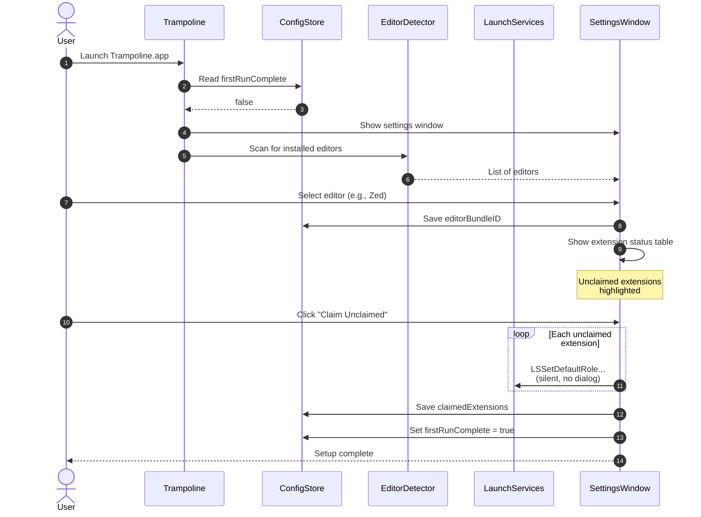

## F-02: File Forwarding (Core Loop)

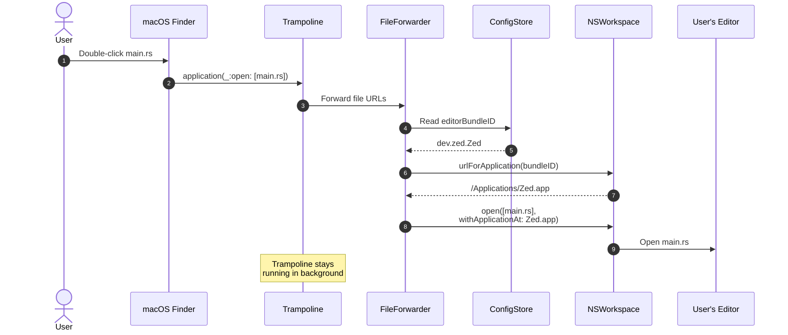

## F-03: Change Editor

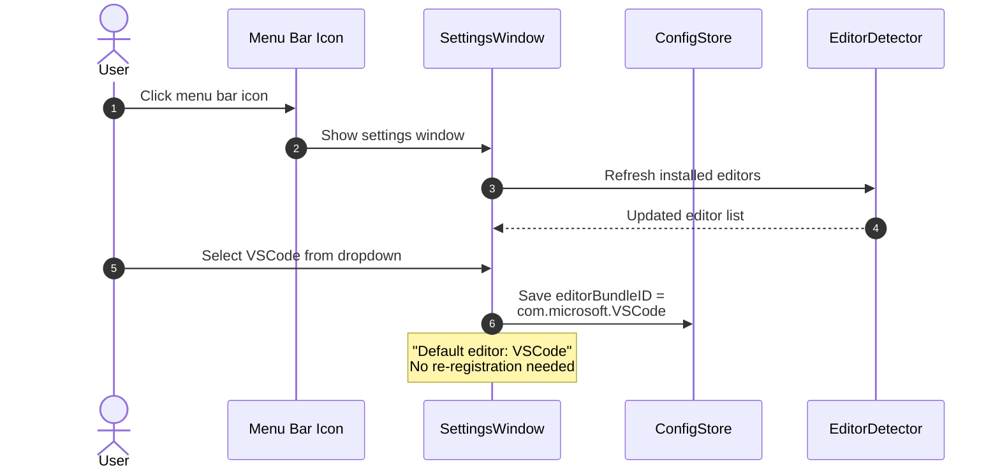

## F-04: Claim Extensions

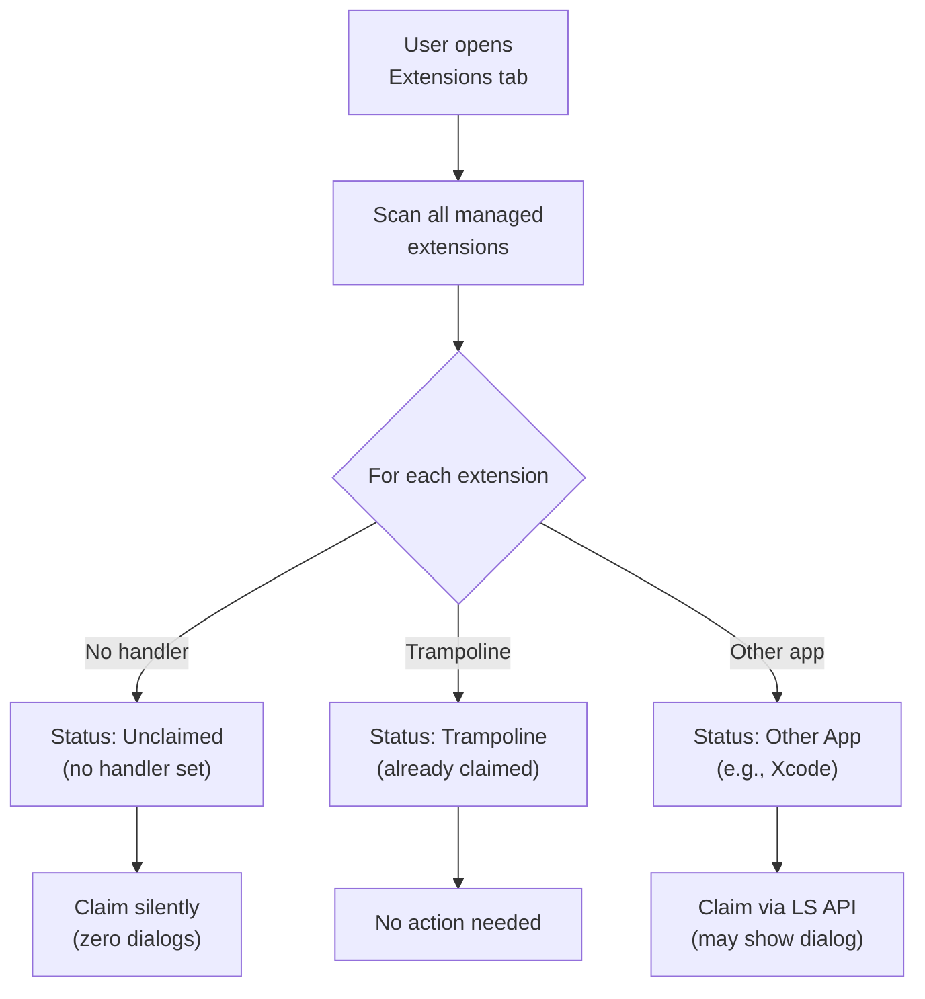

### Extension Claiming Detail

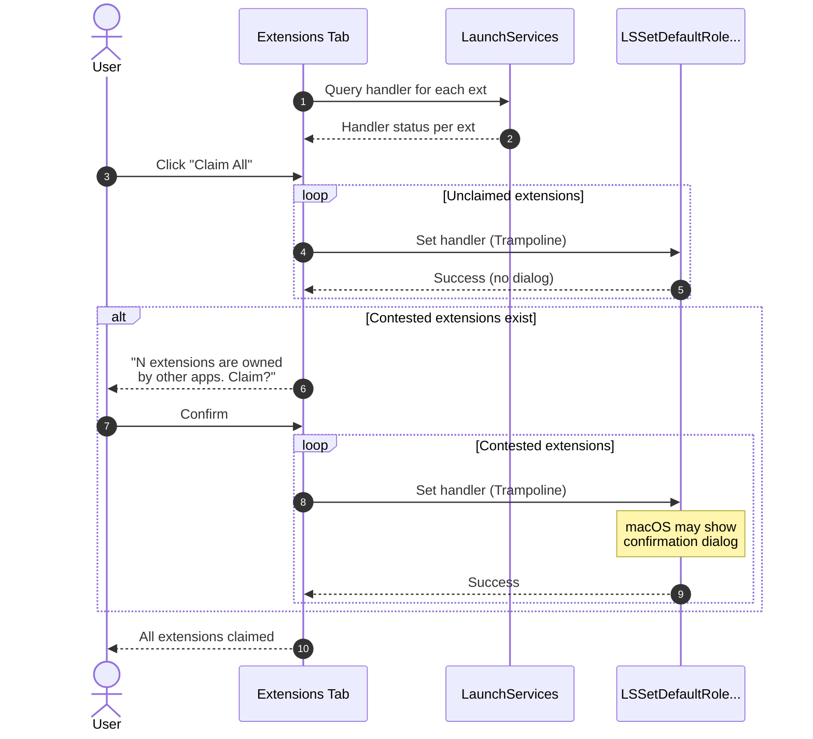

## F-05: CLI Operations

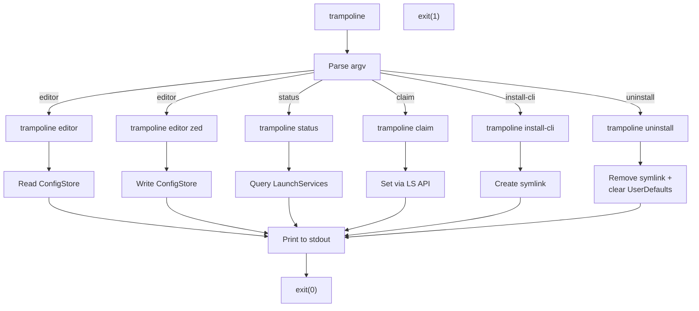

### CLI Output Examples

```
$ trampoline editor
dev.zed.Zed (Zed)

$ trampoline editor vscode
Default editor set to: Visual Studio Code (com.microsoft.VSCode)

$ trampoline status
Extension  Handler              Status
.ts        com.maelos.trampoline  Claimed
.tsx       com.maelos.trampoline  Claimed
.rs        com.maelos.trampoline  Claimed
.json      com.apple.Xcode        Other (Xcode)
.py        (none)                 Unclaimed
...
84 extensions: 60 claimed, 15 other, 9 unclaimed

$ trampoline claim --all
Claiming 9 unclaimed extensions... done (no dialogs)
Claiming 15 contested extensions...
  .json (Xcode) -> Trampoline ... ok
  .xml (Xcode) -> Trampoline ... ok
  ...
24 extensions claimed.

$ trampoline install-cli
Created symlink: /usr/local/bin/trampoline
```

## F-06: CLI Installation

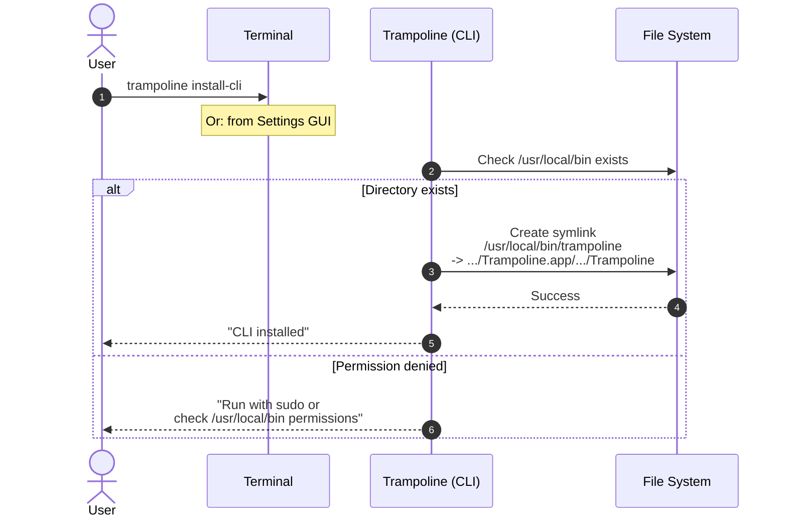

## F-07: Uninstall

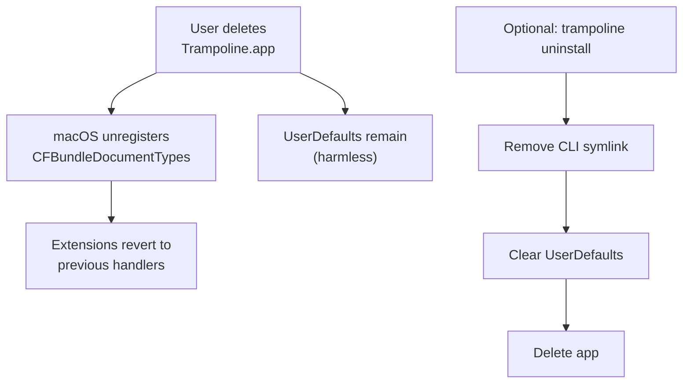

## F-08: Missing Editor Recovery

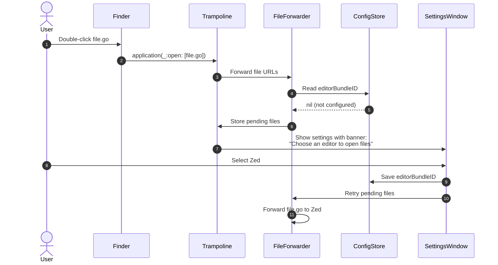

## F-09: Editor Not Found Recovery

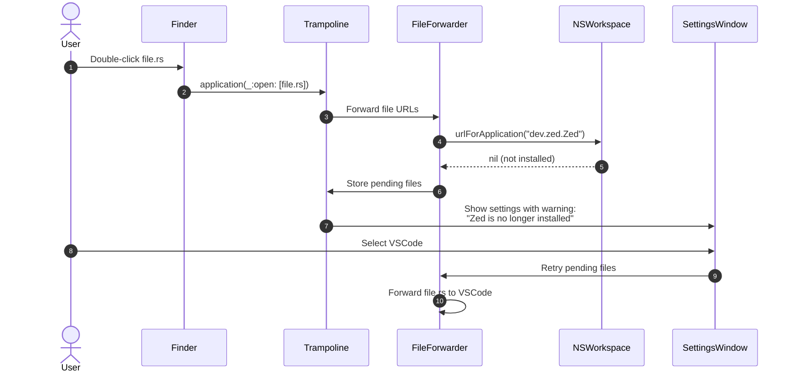

## F-10: App Launch Mode Decision

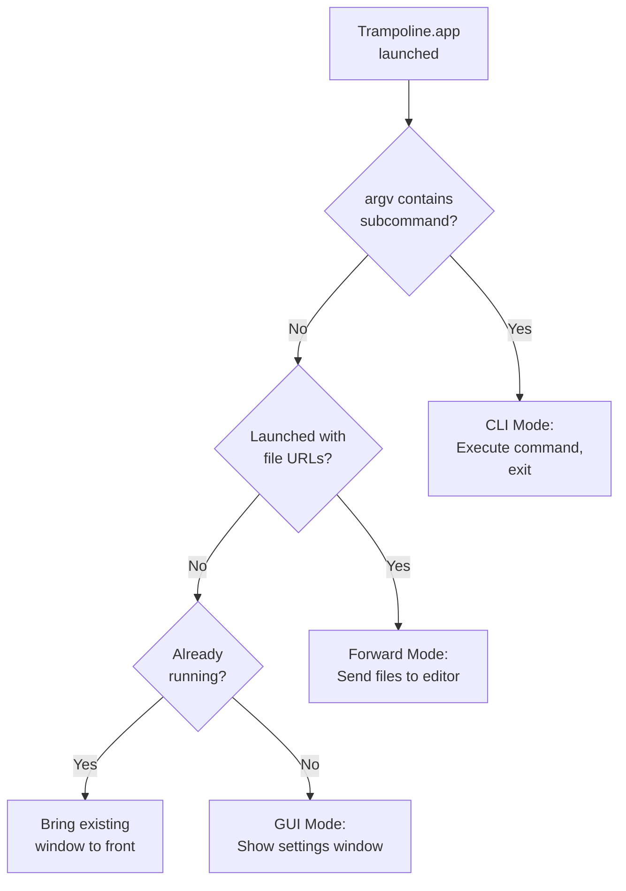
