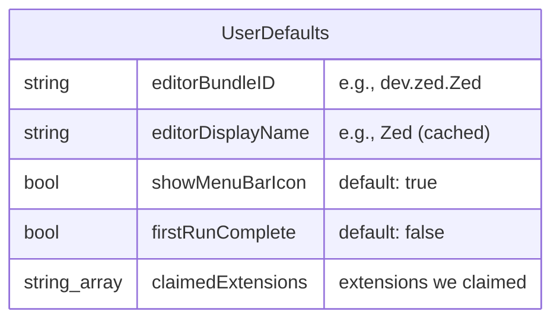
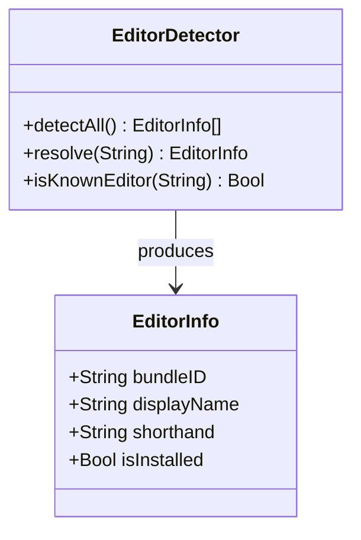

# Data Model

## Configuration Storage

All configuration is stored in `UserDefaults` under the
`com.maelos.trampoline` domain. This is readable/writable from both the GUI
and CLI, and persists across app updates.



### Accessing from CLI

```bash
# Read
defaults read com.maelos.trampoline editorBundleID

# Write (not recommended; use `trampoline editor` instead)
defaults write com.maelos.trampoline editorBundleID -string "dev.zed.Zed"
```

## Info.plist Structure

The `Info.plist` carries three categories of declarations:

### 1. App Identity

```xml
<key>CFBundleIdentifier</key>
<string>com.maelos.trampoline</string>
<key>CFBundleName</key>
<string>Trampoline</string>
<key>CFBundleDisplayName</key>
<string>Trampoline</string>
<key>CFBundleExecutable</key>
<string>Trampoline</string>
<key>CFBundleVersion</key>
<string>1.0</string>
<key>CFBundleShortVersionString</key>
<string>1.0</string>
<key>CFBundlePackageType</key>
<string>APPL</string>
<key>LSMinimumSystemVersion</key>
<string>14.0</string>
<key>LSUIElement</key>
<true/>
```

`LSUIElement = true` makes it a menu bar agent (no Dock icon, no app menu
when not focused). Unlike `LSBackgroundOnly` (used by DevFileTypes), this
allows the app to show windows when needed.

### 2. UTI Declarations (UTExportedTypeDeclarations + UTImportedTypeDeclarations)

These are carried over from the DevFileTypes project. They declare UTIs for
file extensions that macOS doesn't know about or misclassifies.

**Exported** (override system): TypeScript (`.ts`, `.mts`, `.cts`), R (`.r`, `.R`)

**Imported** (new types): All `dev.devfiletypes.*` UTIs for Rust, Go, Zig,
Kotlin, Scala, Vue, Svelte, Astro, Terraform, etc. See the full list in
DevFileTypes' `Info.plist`.

These declarations are identical to DevFileTypes. If the user has both
apps installed, macOS uses the exported declarations from whichever was
registered last. In practice, Trampoline supersedes DevFileTypes.

### 3. CFBundleDocumentTypes (NEW -- the trampoline mechanism)

This is the core of the trampoline pattern. Each extension group gets a
`CFBundleDocumentTypes` entry declaring Trampoline as an `Editor` with
`LSHandlerRank = Default`.

```xml
<key>CFBundleDocumentTypes</key>
<array>
    <!-- TypeScript files -->
    <dict>
        <key>CFBundleTypeName</key>
        <string>TypeScript Source</string>
        <key>CFBundleTypeRole</key>
        <string>Editor</string>
        <key>LSHandlerRank</key>
        <string>Default</string>
        <key>LSItemContentTypes</key>
        <array>
            <string>dev.devfiletypes.typescript-source</string>
        </array>
    </dict>

    <!-- Rust files -->
    <dict>
        <key>CFBundleTypeName</key>
        <string>Rust Source</string>
        <key>CFBundleTypeRole</key>
        <string>Editor</string>
        <key>LSHandlerRank</key>
        <string>Default</string>
        <key>LSItemContentTypes</key>
        <array>
            <string>dev.devfiletypes.rust-source</string>
        </array>
    </dict>

    <!-- JSON files (system UTI) -->
    <dict>
        <key>CFBundleTypeName</key>
        <string>JSON Document</string>
        <key>CFBundleTypeRole</key>
        <string>Editor</string>
        <key>LSHandlerRank</key>
        <string>Alternate</string>
        <key>LSItemContentTypes</key>
        <array>
            <string>public.json</string>
        </array>
    </dict>

    <!-- Python files (system UTI) -->
    <dict>
        <key>CFBundleTypeName</key>
        <string>Python Source</string>
        <key>CFBundleTypeRole</key>
        <string>Editor</string>
        <key>LSHandlerRank</key>
        <string>Alternate</string>
        <key>LSItemContentTypes</key>
        <array>
            <string>public.python-script</string>
        </array>
    </dict>

    <!-- ... one entry per UTI or extension group ... -->
</array>
```

### LSHandlerRank Strategy

| Rank        | When to use                                | Dialog behavior                                             |
| ----------- | ------------------------------------------ | ----------------------------------------------------------- |
| `Default`   | For UTIs we declared (dev.devfiletypes.\*) | macOS makes us the default silently -- we declared the type |
| `Alternate` | For system UTIs (public.json, etc.)        | macOS adds us as a candidate but doesn't steal the default  |

For `Alternate`-ranked types, the user must explicitly claim them via the
Extensions tab or CLI (`trampoline claim`). This triggers
`LSSetDefaultRoleHandlerForContentType` which may show a dialog if another
app is the current handler.

For `Default`-ranked types (our own UTIs), macOS makes Trampoline the handler
automatically when the app is registered -- **zero dialogs**.

## Extension Registry

The full list of managed extensions, organized by category. Each extension
maps to either a custom UTI (from DevFileTypes) or a system UTI.

### Extensions with Custom UTIs (Default rank -- zero dialogs)

| Extensions        | UTI                                  | Category       |
| ----------------- | ------------------------------------ | -------------- |
| ts, mts, cts      | dev.devfiletypes.typescript-source   | TypeScript     |
| r, R              | dev.devfiletypes.r-source            | R              |
| tsx               | dev.devfiletypes.tsx-source          | React          |
| jsx               | dev.devfiletypes.jsx-source          | React          |
| vue               | dev.devfiletypes.vue-source          | Web frameworks |
| svelte            | dev.devfiletypes.svelte-source       | Web frameworks |
| astro             | dev.devfiletypes.astro-source        | Web frameworks |
| rs                | dev.devfiletypes.rust-source         | Systems        |
| go                | dev.devfiletypes.go-source           | Systems        |
| zig               | dev.devfiletypes.zig-source          | Systems        |
| nim               | dev.devfiletypes.nim-source          | Systems        |
| kt, kts           | dev.devfiletypes.kotlin-source       | JVM            |
| scala, sc         | dev.devfiletypes.scala-source        | JVM            |
| groovy, gvy       | dev.devfiletypes.groovy-source       | JVM            |
| cs                | dev.devfiletypes.csharp-source       | .NET           |
| fs, fsi, fsx      | dev.devfiletypes.fsharp-source       | .NET           |
| dart              | dev.devfiletypes.dart-source         | Mobile         |
| lua               | dev.devfiletypes.lua-source          | Scripting      |
| coffee            | dev.devfiletypes.coffeescript-source | Scripting      |
| ex, exs           | dev.devfiletypes.elixir-source       | Functional     |
| elm               | dev.devfiletypes.elm-source          | Functional     |
| hs, lhs           | dev.devfiletypes.haskell-source      | Functional     |
| ml, mli           | dev.devfiletypes.ocaml-source        | Functional     |
| tf, tfvars        | dev.devfiletypes.terraform-source    | Config/IaC     |
| hcl               | dev.devfiletypes.hcl-source          | Config/IaC     |
| toml              | dev.devfiletypes.toml-source         | Config/IaC     |
| nix               | dev.devfiletypes.nix-source          | Config/IaC     |
| dhall             | dev.devfiletypes.dhall-source        | Config/IaC     |
| graphql, gql      | dev.devfiletypes.graphql-source      | Schema         |
| proto             | dev.devfiletypes.protobuf-source     | Schema         |
| prisma            | dev.devfiletypes.prisma-source       | Schema         |
| sass              | dev.devfiletypes.sass-source         | Stylesheets    |
| scss              | dev.devfiletypes.scss-source         | Stylesheets    |
| less              | dev.devfiletypes.less-source         | Stylesheets    |
| styl              | dev.devfiletypes.stylus-source       | Stylesheets    |
| jade, pug         | dev.devfiletypes.jade-source         | Templates      |
| ejs               | dev.devfiletypes.ejs-source          | Templates      |
| hbs, handlebars   | dev.devfiletypes.handlebars-source   | Templates      |
| mustache          | dev.devfiletypes.mustache-source     | Templates      |
| twig              | dev.devfiletypes.twig-source         | Templates      |
| jinja, jinja2, j2 | dev.devfiletypes.jinja-source        | Templates      |
| mdx               | dev.devfiletypes.mdx-source          | Documents      |
| ipynb             | dev.devfiletypes.jupyter-notebook    | Documents      |

### Extensions with System UTIs (Alternate rank -- may need claiming)

| Extensions | UTI                  | Category  |
| ---------- | -------------------- | --------- |
| json       | public.json          | Data      |
| yaml, yml  | public.yaml          | Data      |
| xml        | public.xml           | Data      |
| py         | public.python-script | Scripting |
| rb         | public.ruby-script   | Scripting |
| bash       | public.bash-script   | Shell     |
| zsh        | public.zsh-script    | Shell     |
| sql        | public.sql-script    | Data      |

### Extensions with Dynamic UTIs (Alternate rank -- resolved at runtime)

These extensions don't have well-known system UTIs. Trampoline resolves them
at runtime via `UTType(filenameExtension:)` and registers using the resolved
dynamic UTI.

| Extensions               | Category         |
| ------------------------ | ---------------- |
| env                      | Config           |
| conf                     | Config           |
| tsv                      | Data             |
| lock                     | Package managers |
| gitignore, gitattributes | Git              |
| editorconfig             | Editor config    |
| dockerfile               | Containers       |
| makefile                 | Build            |
| gemspec                  | Ruby             |
| cmake                    | Build            |
| gradle                   | Build            |
| properties               | Config           |
| patch, diff              | Version control  |

## Editor Registry

Known editors with their bundle IDs, used for shorthand resolution in the
CLI and for auto-detection.



| Shorthand       | Bundle ID                     | Display Name       |
| --------------- | ----------------------------- | ------------------ |
| zed             | dev.zed.Zed                   | Zed                |
| vscode          | com.microsoft.VSCode          | Visual Studio Code |
| vscode-insiders | com.microsoft.VSCodeInsiders  | VS Code Insiders   |
| cursor          | com.todesktop.230313mzl4w4u92 | Cursor             |
| sublime         | com.sublimetext.4             | Sublime Text       |
| sublime3        | com.sublimetext.3             | Sublime Text 3     |
| nova            | com.panic.Nova                | Nova               |
| bbedit          | com.barebones.bbedit          | BBEdit             |
| textmate        | com.macromates.TextMate       | TextMate           |
| webstorm        | com.jetbrains.WebStorm        | WebStorm           |
| intellij        | com.jetbrains.intellij        | IntelliJ IDEA      |
| fleet           | com.jetbrains.fleet           | Fleet              |
| atom            | com.github.atom               | Atom               |
