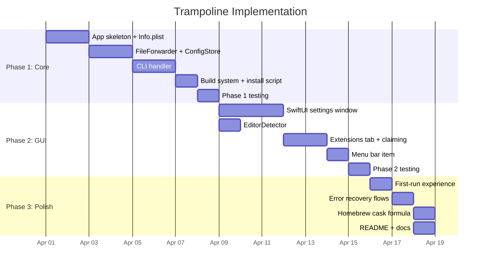

# Implementation Phases

## Phase Overview



## Phase 1: Core Trampoline

**Goal:** Files double-clicked in Finder open in the user's editor via
Trampoline. CLI works. No GUI yet.

### Deliverables

| Item                      | Description                                             |
| ------------------------- | ------------------------------------------------------- |
| `Trampoline.app` bundle   | With full `Info.plist` (UTIs + `CFBundleDocumentTypes`) |
| Swift `@main` entry point | `NSApplicationDelegate` with `application(_:open:)`     |
| `FileForwarder`           | Reads editor pref, forwards via `NSWorkspace`           |
| `ConfigStore`             | `UserDefaults` wrapper                                  |
| `CLIHandler`              | `editor`, `status`, `claim`, `install-cli` subcommands  |
| `Makefile`                | Build, install, clean targets                           |

### Configuration (Phase 1)

Since there's no GUI yet, the editor is set via CLI:

```bash
trampoline editor zed
trampoline claim --all
```

### Validation

1. Install Trampoline.app to /Applications
2. Set editor via CLI
3. Double-click a `.rs` file in Finder
4. Verify Zed opens with the file
5. `trampoline status` shows correct mapping

---

## Phase 2: GUI

**Goal:** Settings window with editor picker, extension table, and menu bar
integration.

### Deliverables

| Item                | Description                                            |
| ------------------- | ------------------------------------------------------ |
| `SettingsWindow`    | SwiftUI window with General / Extensions / About tabs  |
| `EditorDetector`    | Scan for installed editors via Spotlight + NSWorkspace |
| `ExtensionTable`    | Searchable, sortable table with claim/release actions  |
| `MenuBarItem`       | NSStatusItem with dropdown menu                        |
| First-run detection | Show settings on first launch                          |

### Validation

1. Launch Trampoline.app with no prior config
2. Settings window shows with editor picker
3. Select Zed; claim extensions
4. Verify menu bar icon appears
5. Double-click a file; verify forwarding works
6. Open settings via menu bar icon; change editor; verify

---

## Phase 3: Polish

**Goal:** Error handling, first-run UX, distribution.

### Deliverables

| Item                    | Description                                                          |
| ----------------------- | -------------------------------------------------------------------- |
| First-run experience    | Welcome banner, guided setup                                         |
| Missing editor recovery | Show settings with warning when editor not found                     |
| Pending files queue     | Forward files that triggered missing-editor flow after editor is set |
| Homebrew cask           | `brew install --cask trampoline`                                     |
| Code signing            | Developer ID signing + notarization                                  |
| README.md               | Project documentation                                                |

### Validation

1. Uninstall Zed; double-click a `.rs` file; verify settings window with warning
2. Install VSCode; select it; verify the `.rs` file opens in VSCode
3. `brew install --cask trampoline` on a clean machine
4. Verify Gatekeeper doesn't block the app

---

## Decision Log

| Decision                                    | Rationale                                                                                                                         | Alternative Considered                            |
| ------------------------------------------- | --------------------------------------------------------------------------------------------------------------------------------- | ------------------------------------------------- |
| SwiftUI for GUI, AppKit for lifecycle       | SwiftUI can't receive `application(_:open:)` events; AppKit is required for the delegate. SwiftUI is cleaner for the settings UI. | Pure AppKit (more code, less maintainable)        |
| UserDefaults for config                     | Simple, CLI-accessible, no file management.                                                                                       | JSON config file (more complex, no benefit)       |
| Symlink for CLI                             | Zero-cost, same binary.                                                                                                           | Separate CLI binary (build complexity)            |
| `LSHandlerRank = Default` for custom UTIs   | Silently claims extensions we declared.                                                                                           | `Owner` rank (same effect but less documented)    |
| `LSHandlerRank = Alternate` for system UTIs | Doesn't steal from Xcode/etc. without explicit claim.                                                                             | `Default` for all (aggressive, may confuse users) |
| No per-extension editor routing (v1)        | Keeps scope small.                                                                                                                | Per-extension config (future version)             |
| Menu bar agent (`LSUIElement`)              | No Dock clutter. User can still open settings.                                                                                    | `LSBackgroundOnly` (can't show windows)           |
| macOS 14+ minimum                           | SwiftUI maturity, modern `UTType` APIs.                                                                                           | macOS 12+ (limits SwiftUI features)               |
